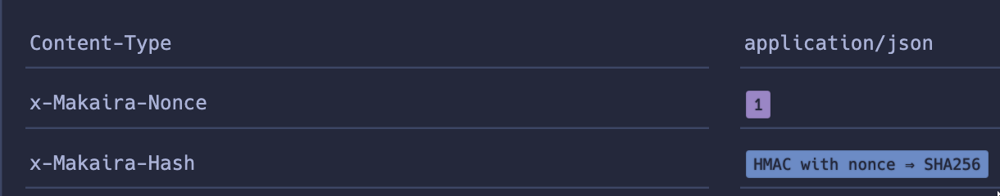
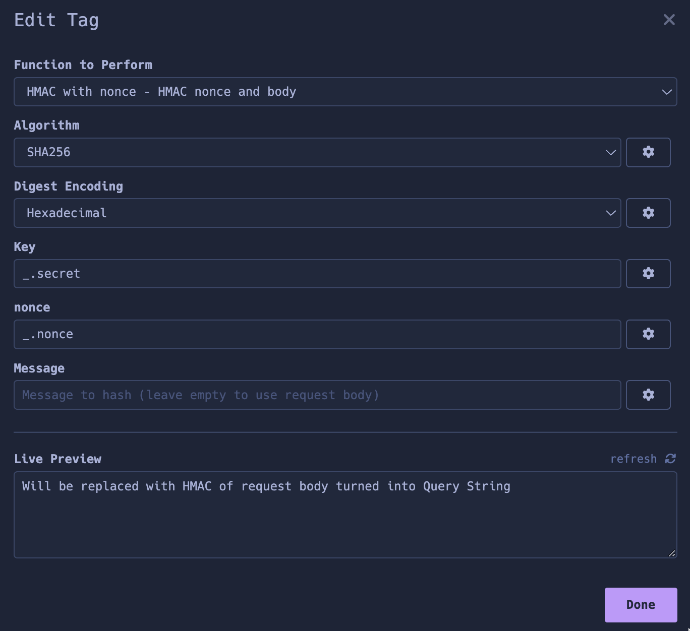

 
# plugin to add payload based HMAC to a header property which also applies none to the payload string for [Insomnia](https://insomnia.rest)

Based on [insomnia-plugin-request-body-hmac-query-string](https://github.com/grunka/insomnia-plugin-request-body-hmac),
which was based on [Template tag for HMAC by Grunka](https://github.com/Beninho/insomnia-plugin-request-body-hmac-query-string)

I've just made it work somehow, no guarantees, no fixes, no nothing.
Check yourself what you use and do so at your own risk!

## Install

1. In Insomnia, go to _Application_ and select _Preferences_
2. Click on _Plugins_
3. Paste `insomnia-plugin-hmac-makaira` into the package name field
4. Click on _Install Plugin_

## Use
1. use "HMAC with nonce in header property"
   

2. select the options
   

## License

[MIT License](./LICENSE)
